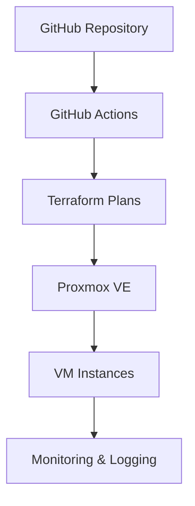

# Proxmox Actions Lab 🚀

[](https://github.com/Sebastian-Koziatek/proxmox-actions-lab/actions)
[](https://terraform.io)
[](https://proxmox.com)
[](LICENSE)

> **Enterprise-grade Infrastructure as Code (IaC) solution** for automated Proxmox VM provisioning, management, and lifecycle orchestration through GitHub Actions workflows.

## 🎯 Project Overview

This repository serves as a **comprehensive training platform** for IT professionals seeking hands-on experience with modern Infrastructure as Code (IaC) practices. Developed for **professional IT training courses** that I conduct, this project demonstrates enterprise-grade DevOps workflows for managing virtual machine infrastructure in Proxmox environments.

### 🎓 Educational Purpose

This infrastructure is specifically designed for:
- **DevOps Training Workshops** - Learn Terraform, GitHub Actions, and infrastructure automation
- **Enterprise IT Courses** - Understand production-grade infrastructure patterns
- **Hands-on Laboratories** - Practice real-world scenarios in controlled environment
- **Certification Preparation** - Gain practical experience for cloud and DevOps certifications

*Perfect for training environments, workshops, and educational demonstrations of automated deployment scenarios.*

### 🏗️ Architecture



## 🛠️ Technology Stack

| Component | Technology | Purpose |
|-----------|------------|---------|
| **IaC Engine** | Terraform | Infrastructure provisioning & state management |
| **CI/CD** | GitHub Actions | Automated deployment workflows |
| **Virtualization** | Proxmox VE | Virtual machine hypervisor |
| **Operating Systems** | RHEL, AlmaLinux | Enterprise Linux distributions |
| **Monitoring** | Grafana, Zabbix | Infrastructure observability |

## 📁 Project Structure

```
proxmox-actions-lab/
├── .github/workflows/          # GitHub Actions CI/CD pipelines
│   ├── alma.yml               # AlmaLinux VM deployment
│   ├── grafana.yml            # Grafana monitoring stack
│   ├── redhat.yml             # Red Hat Enterprise Linux
│   └── zabbix-agent.yml       # Zabbix monitoring agents
├── Alma/                      # AlmaLinux infrastructure modules
│   ├── main.tf                # Primary configuration
│   ├── providers.tf           # Terraform providers
│   ├── variables.tf           # Input variables
│   ├── terraform.tfvars       # Variable values
│   └── modules/               # Reusable Terraform modules
├── Grafana/                   # Grafana monitoring infrastructure
│   ├── main.tf                # Grafana VM configurations
│   ├── providers.tf           # Terraform providers
│   ├── variables.tf           # Input variables
│   ├── terraform.tfvars       # Variable values
│   └── modules/               # VM provisioning modules
├── RedHat/                    # Red Hat Enterprise Linux
│   ├── main.tf                # RHEL VM configurations
│   ├── providers.tf           # Terraform providers
│   ├── variables.tf           # Input variables
│   ├── terraform.tfvars       # Variable values
│   └── modules/               # RHEL deployment modules
├── Zabbix-agent/             # Zabbix monitoring infrastructure
│   ├── main.tf                # Zabbix agent configurations
│   ├── providers.tf           # Terraform providers
│   ├── variables.tf           # Input variables
│   ├── terraform.tfvars       # Variable values
│   └── modules/               # Monitoring deployment modules
├── .gitignore                 # Git ignore patterns
├── LICENSE                    # MIT license
└── README.md                  # Project documentation
```

## 🚀 Quick Start

### Prerequisites

- **Proxmox VE** cluster with API access
- **GitHub Secrets** configured for Proxmox authentication
- **Terraform** >= 1.0
- Valid **SSL certificates** for Proxmox API

### 1. Security Setup

⚠️ **Important Security Notice**: This is a training environment with hardcoded credentials for educational purposes. **Never use these patterns in production!**

#### For Production Use:
Configure the following GitHub Secrets for secure credential management:

```bash
PROXMOX_API_TOKEN      # API token (recommended)
PROXMOX_VE_ENDPOINT    # https://your-proxmox-host:8006/
```

#### For Training Environment:
- Default SSH credentials: `szkolenie/szkolenie`
- Modified SSH port: `60601` for security
- Network isolation: VLANs for training separation

> 🔒 **Production Security**: Replace all default passwords, use API tokens, implement proper RBAC, and enable SSL verification.

### 2. Deploy Infrastructure

Trigger deployments via GitHub Actions or manually:

```bash
# Clone repository
git clone https://github.com/Sebastian-Koziatek/proxmox-actions-lab.git
cd proxmox-actions-lab

# Initialize Terraform (example for Grafana)
cd Grafana
terraform init
terraform plan
terraform apply
```

### 3. Manage VM Fleet

Use workflow parameters to control VM provisioning:

- **Range specification**: `1,3,5-10` (deploy specific VMs)
- **Bulk operations**: `all` (deploy entire fleet)
- **Environment isolation**: Separate workflows per OS type

## 🔧 Configuration

### Terraform Variables

Each module supports customizable parameters:

```hcl
variable "zakres" {
  description = "VM range specification (e.g., '1,3,5-10' or 'all')"
  type        = string
  default     = "1"
}

variable "vm_count" {
  description = "Number of VMs to provision"
  type        = number
  default     = 1
}
```

### GitHub Actions Workflows

Automated workflows support:
- ✅ **Parallel deployments**
- ✅ **State management**
- ✅ **Rollback capabilities**
- ✅ **Environment validation**
- ✅ **Cost optimization**

## 📊 Monitoring & Observability

### Grafana Stack
- **Real-time metrics** dashboard
- **Infrastructure health** monitoring
- **Resource utilization** tracking

### Zabbix Integration
- **Agent-based monitoring**
- **Alerting & notifications**
- **Performance analytics**

## 🔒 Security & Compliance

- **Encrypted state storage** in Terraform Cloud/Backend
- **Secret management** via GitHub Secrets
- **Network segmentation** with VLAN isolation
- **Access control** through Proxmox RBAC

## 🤝 About This Project

This is a **demonstration repository** showcasing professional Infrastructure as Code practices and DevOps automation skills. Created as part of my professional portfolio to demonstrate expertise in:

- **Enterprise-grade Terraform** modules and best practices
- **GitHub Actions** CI/CD pipeline automation  
- **Proxmox virtualization** infrastructure management
- **Multi-environment** deployment strategies
- **Security-conscious** infrastructure design

*This project serves as a practical example of skills applied in professional IT training courses that I conduct.*

## 📄 License

This project is licensed under the **MIT License** - see the [LICENSE](LICENSE) file for details.

## � Contact

**Sebastian Koziatek** - Professional DevOps Engineer & IT Trainer
- **LinkedIn**: [Sebastian Koziatek](https://www.linkedin.com/in/sebastiankoziatek/)
- **Email**: sebastian.koziatek@sadmin.pl

---

⭐ **This repository demonstrates production-ready infrastructure automation capabilities for enterprise environments.**
